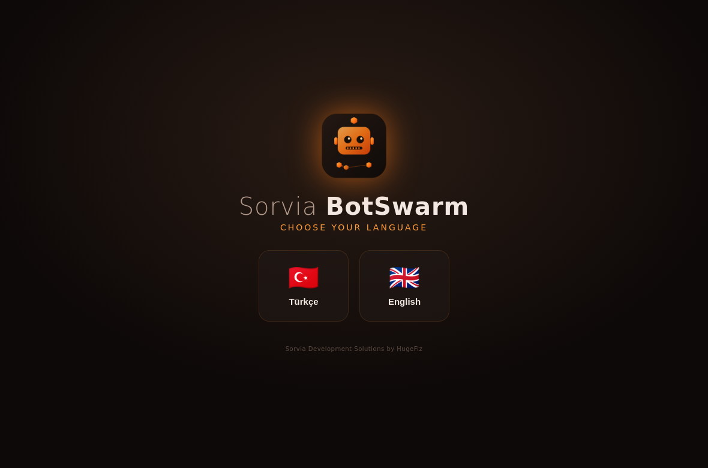
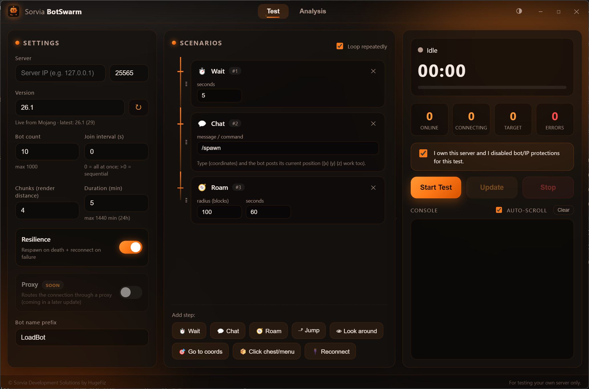
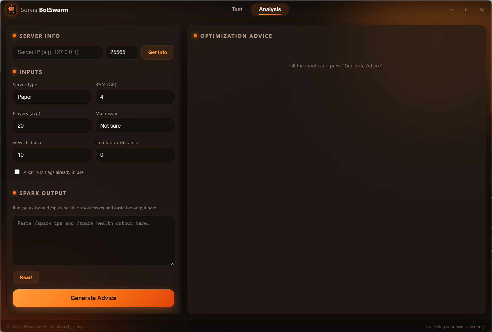
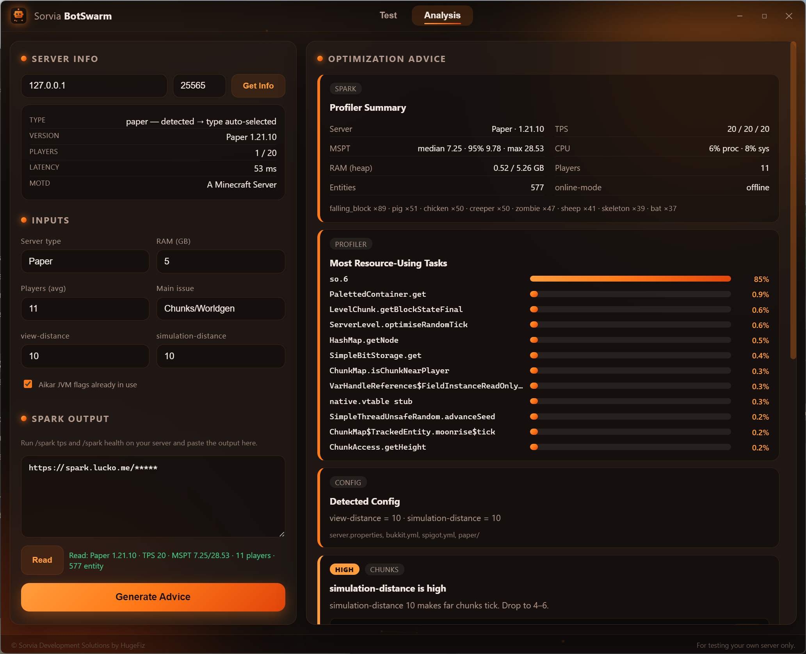

<div align="center">


# Sorvia BotSwarm

**Minecraft server bot load-tester & optimization advisor**

*Sorvia Development Solutions by HugeFiz*

</div>

---

Sorvia BotSwarm connects a configurable swarm of bots to a Minecraft server **you own**,
runs scripted scenarios (walk, chat, jump, look, roam, go-to-coords, menu clicks, reconnect),
and helps you measure and improve
your server's performance. It also reads your **Spark** output and generates prioritized
optimization advice.

> ⚠️ **For your own servers only.**
> This tool has **no protection-bypass logic**. It performs honest client connections; you
> disable your *own* server's anti-bot / per-IP limits for the test. The app requires an
> ownership confirmation before every run, caps the swarm at **1000 bots**, and hard-limits
> any test to **1440 minutes (24 h)**.

---

## 📸 Screenshots

| First-run language picker | Test tab |
|---|---|
|  |  |

| Analysis tab |
|---|
|  |

| Spark profiler link → full report analysis |
|---|
|  |

---

## ✨ Features

### Test tab
- Connect bots by **IP / port / version** — up to **1000** (hard cap).
- **Sequential join** — bots connect **one at a time** (each waits until the previous is in),
  which spreads the load so the UI never freezes. The **join interval** adds extra spacing.
- **Chunk / render distance** per bot.
- **Duration** up to **1440 min / 24 h** (fixed ceiling to prevent misuse).
- **Ownership confirmation** gate — the test won't start until you confirm.
- **Roam** avoids obstacles automatically — routes around blocks and avoids **water/lava** and **big cliffs** (via `mineflayer-pathfinder`; no toggle needed).
- **Resilience** — bots auto-respawn on death (restarting their scenario) and reconnect
  with exponential backoff if a connection drops.
- **Scenario tree** — add steps in order and drag to reorder: **Wait, Chat (command),
  Roam (radius + time), Jump, Look around, Go to coords, Click chest/menu, Reconnect**.
  Loop the whole list to sustain load.
  - A **Chat** step understands `{coordinates}` (also `{coords}`, `{x}`, `{y}`, `{z}`) and posts
    the bot's position at the moment the line is sent.
  - A **Reconnect** step makes the bot leave and rejoin after a delay — for testing join
    churn, login queues and per-join plugin work.
- **Smooth movement at scale** — the pathfinding budget scales with the swarm: up to 25 bots get
  the full budget (they hop ledges, cross gaps and route around trees like a single bot would),
  and bigger runs cap how many bots search at once and how long each search slice runs, so the
  shared event loop never stalls. Bots walk in short legs inside the chunks the server actually
  sent — never into unloaded terrain — and nudge themselves free if a leg gets them stuck.
- **Resource packs are confirmed without downloading** — bots report the pack as
  accepted → downloaded → loaded, so servers that hold players on a loading screen until the
  pack is confirmed let the swarm in, without every bot fetching the file.
- **Built-in console** — logs are batched for smooth UI even with 100 bots.

### Analysis tab
- **Get Info** — pings the server and shows version, detected type
  (Paper / Purpur / Spigot / Fabric / …), player count, latency and MOTD.
- **Spark — paste a profiler link OR text:**
  - Paste a **`/spark profiler` report link** (e.g. `https://spark.lucko.me/xxxxx`) and the app
    **downloads and decodes the report** (gzip protobuf), then extracts:
    - a **Profiler Summary** (server + MC version, TPS, MSPT median/95%/max, CPU, heap RAM,
      players, live entity counts, online-mode),
    - the **Most Resource-Using Tasks** — the hottest methods by self-time, with % bars,
    - the server's **exported config** (view-distance / simulation-distance) — which it
      auto-fills into the inputs.
  - Or paste the **text** of `/spark tps` + `/spark health` and it reads TPS/MSPT/CPU/memory.
- **Generate Advice** — compares server type + resources + Spark data (including the hottest
  method and entity counts) and produces **severity-ranked** (CRITICAL → TIP) optimization
  suggestions, each with a copyable config/JVM snippet.

> Reading a profiler link fetches `https://spark-usercontent.lucko.me/<code>` — the app needs
> internet access for that step (everything else is local).

### General
- **First-run language picker** (English screen), remembered afterward. **TR / EN** UI.
- Animated loading screen; modern animated interface; embedded bot icon.
- Version list refreshes from **Mojang** on each launch (intersected with the versions the bot
  engine can actually connect with — new releases appear without an app update).
- **Live Update** — change scenarios/settings mid-test and apply them without disconnecting the bots.
- **Theme panel** — accent colour, background colour, **panel transparency**, **window
  transparency** and an animated-background toggle. Changing a theme **fades** across the whole
  UI — panels, gradients, borders, glows and button shadows — instead of snapping.
  - **Window transparency** turns the app's background into frosted glass — the desktop behind
    shows through, blurred by Windows, while panels, buttons and text stay readable (the same
    look a translucent terminal has). Slide further for more glass; it never goes fully clear.
    Needs Windows 11 22H2+; elsewhere the window stays solid and the console tells you why.
- **Proxy** — a placeholder toggle under Resilience, marked *soon*: connection proxying is
  planned for a later update.
- **Single instance** — launching again focuses the open window.
- Settings are saved to a hidden per-user folder (see below).
- **Uninstaller** — offers a **Complete removal** option that also deletes settings and app data.
  Leave it unticked (the default) and a reinstall picks up your theme, scenarios and server.

---

## 🧩 How it works

- **[Electron](https://www.electronjs.org/)** — desktop shell + UI (renderer).
- **[mineflayer](https://github.com/PrismarineJS/mineflayer)** — the bot client engine
  (loaded lazily on first test, runs in the main process).
- **[mineflayer-pathfinder](https://github.com/PrismarineJS/mineflayer-pathfinder)** — the
  obstacle-avoiding movement behind **Roam** and **Go to coords** (always on; there is no
  toggle to turn it off).
- **[minecraft-protocol](https://github.com/PrismarineJS/node-minecraft-protocol)** — server
  ping (Analysis tab) and the authoritative list of connectable versions.
- **[protobufjs](https://github.com/protobufjs/protobuf.js)** — decodes Spark profiler reports.

---

## ✅ Requirements

- **[Node.js](https://nodejs.org) LTS** (v18+; v20/22 recommended) and npm.

---

## ▶️ Run from source

```bash
npm install
npm start
```

---

## 📦 Build & install

First install dependencies once: `npm install`.

### Windows — installer `setup.exe` (recommended)
```bash
npm run dist:win
```
Output: `dist/Sorvia-BotSwarm-1.2.5-setup.exe`

A clean English setup wizard:
- shows a **license / terms** page you must accept,
- installs **per-user** (no admin prompt) and adds a **Start-menu** entry,
- on the final page lets you choose, via checkboxes, whether to **Launch Sorvia BotSwarm**
  and **Create a desktop shortcut** — neither is forced.

After installing, the app opens **instantly** on every launch (nothing to unpack).
A one-click helper is included: run **`build-win.bat`**.

> **Windows build note:** electron-builder unpacks a signing archive that contains symlinks.
> If the build fails with *"cannot create symbolic link"*, either run the terminal / `build-win.bat`
> **as Administrator**, or enable **Windows Developer Mode**
> (*Settings → Privacy & security → For developers → Developer Mode: On*).

### Windows — portable `.exe` (no install)
```bash
npm run dist:win-portable
```
Output: `dist/Sorvia-BotSwarm-1.2.5-portable.exe` — double-click, no install, no admin.
The first launch unpacks to a fixed folder (`%TEMP%\SorviaBotSwarm`) and reuses it, so only the
first launch takes a few seconds; later launches are fast. (The installer above is faster still.)

### Linux — `AppImage`
```bash
npm run dist:linux
```
Output: `dist/Sorvia-BotSwarm-1.2.5.AppImage`
```bash
chmod +x dist/Sorvia-BotSwarm-1.2.5.AppImage
./dist/Sorvia-BotSwarm-1.2.5.AppImage
```
If you hit a FUSE error on newer distros, run with `--appimage-extract-and-run` or install
`libfuse2`. You can also just run from source with `npm start`.

### macOS — `.dmg`
```bash
npm run dist:mac
```

> Cross-building (e.g. making the Windows `.exe` on Linux) needs **Wine** and isn't
> recommended. Build each OS's package on that OS (or via CI).

---

## 🛠️ Before you test (on your OWN server)

- `online-mode=false` in `server.properties` (bots use offline auth).
- Remove any **per-IP account limit** (all bots come from one IP).
- Disable **anti-bot** protection for the duration of the test.
- Install **[Spark](https://spark.lucko.me)** to use the Analysis advisor
  (`/spark tps`, `/spark health`, `/spark profiler`).

---

## 🚀 Usage

**Load test:** fill server IP/port/version (or leave version on **Auto**) → set bot count,
join interval, chunks, duration, resilience → build your scenario tree → tick the
ownership confirmation → **Start**. Watch the live console and stats; the run stops itself at
the duration limit.

**Analyze:** open the **Analysis** tab → **Get Info** to ping the server → either paste a
`/spark profiler` link, or run `/spark tps` + `/spark health` in-game and paste the text →
**Read** → **Generate Advice**.

---

## 📁 Settings location

Settings (language + form values + scenarios) are stored per-user, outside your desktop:

| OS | Path |
|---|---|
| Windows | `%APPDATA%\Sorvia BotSwarm\settings.json` |
| Linux | `~/.config/Sorvia BotSwarm/settings.json` |
| macOS | `~/Library/Application Support/Sorvia BotSwarm/settings.json` |

---

## 🗂️ Project structure

```
sorvia-botswarm/
├─ src/
│  ├─ main.js          # Electron main process, IPC, window, settings, ping/advisor IPC
│  ├─ preload.js       # secure contextBridge API
│  ├─ bot-manager.js   # bot swarm engine: sequential join, scenarios, respawn, reconnect, caps
│  ├─ versions.js      # connectable version list (minecraft-protocol) ∩ Mojang manifest
│  ├─ advisor.js       # Spark text parsing + rules-based optimization advice
│  ├─ spark-fetch.js   # download + decode /spark profiler reports (protobuf)
│  └─ smoke.js         # headless sanity test (npm run smoke)
├─ renderer/
│  ├─ index.html       # UI markup (loader, splash, tabs, scenario tree, analysis)
│  ├─ styles.css       # theme + animations
│  ├─ app.js           # UI logic, IPC calls, i18n, console
│  └─ i18n.js          # TR / EN strings
├─ assets/             # icon.svg / icon.png / icon.ico
├─ build/              # installer resources (eula.txt, installer.nsh, sidebar/header bitmaps)
├─ screenshots/        # images used in this README
├─ build-win.bat       # one-click Windows build helper
├─ package.json
├─ CHANGELOG.md        # what changed in the current release
├─ LICENSE
└─ README.md
```

---

## ⚠️ Notes & limitations

- **Supported Minecraft versions:** the bot engine connects to versions up to the newest one
  its libraries support (currently **26.1**). For a newer server (e.g. **26.2**), either install
  **ViaVersion + ViaBackwards** on the server and pick **26.1** in the app, or run `npm update`
  once PrismarineJS ships support — new versions then appear in the dropdown automatically.
- Advice **text** is in English (config keys are universal); the UI is TR/EN.
- The advisor reads either a **`/spark profiler` report link** (downloaded & decoded) or the
  **text** of `/spark tps` + `/spark health`. Heap and health-only links aren't used for advice.
- The bot engine is loaded lazily (idle memory stays low) and released after a test stops.
- Pathfinding is CPU-bound and shared with every bot's physics, so the app scales its own
  budget: up to 25 bots search with the full budget, larger runs cap how many bots search at
  once. If movement still looks heavy, lower the roam radius or the bot count.
- **Window transparency** needs **Windows 11 22H2+** (the OS paints the frosted backdrop).
  Elsewhere the window stays solid and the console says so.
- Uninstalling while the app is still running can leave the old files in place — close the app
  first (the installer will also ask).

---

## 📄 License

MIT © Sorvia Development Solutions by HugeFiz — see [LICENSE](LICENSE).
